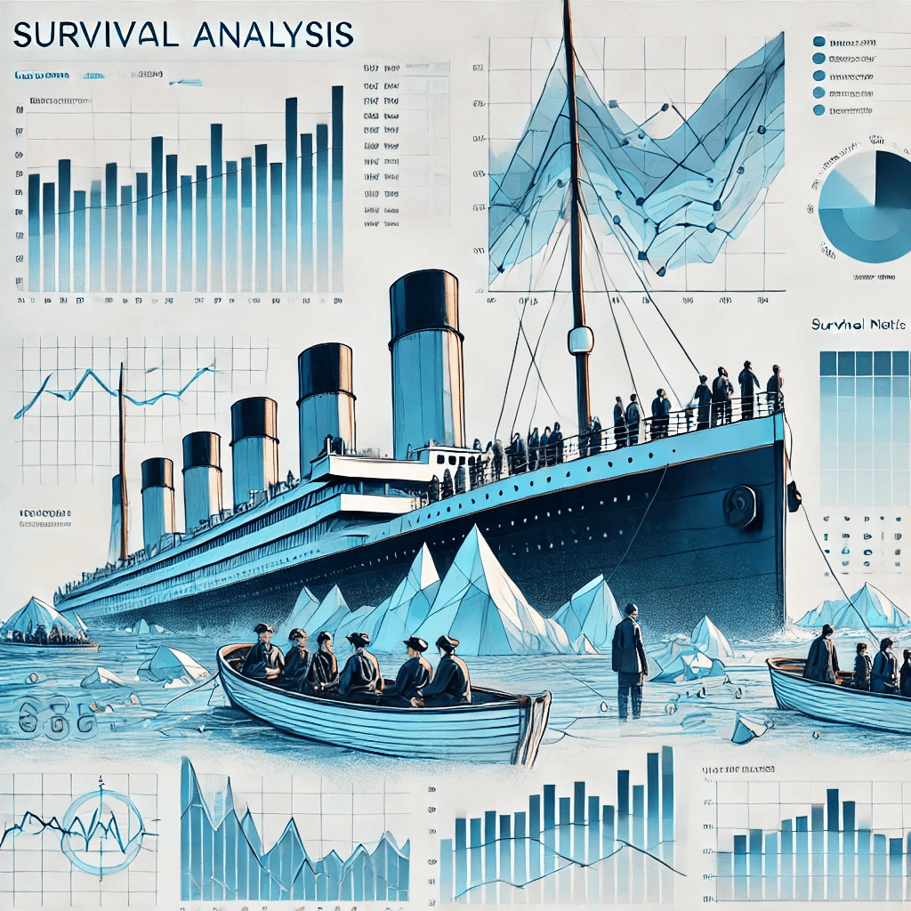
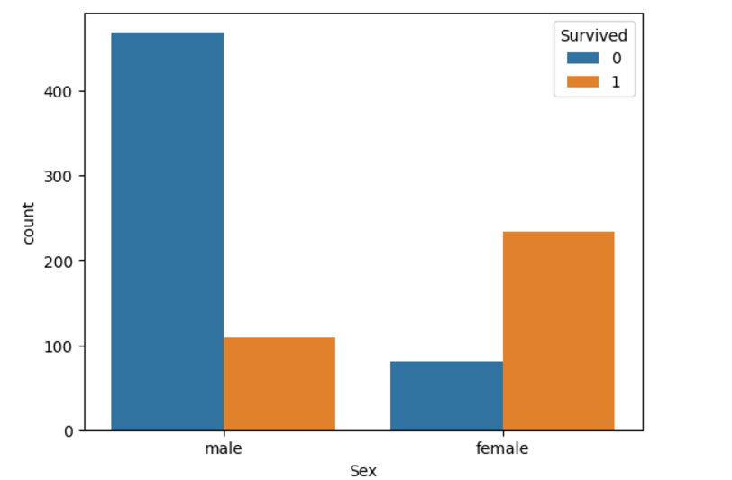
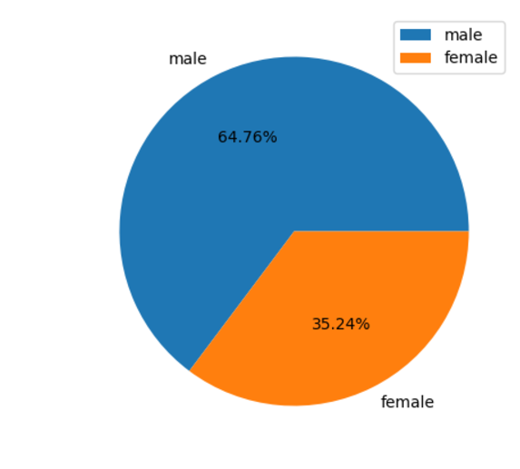
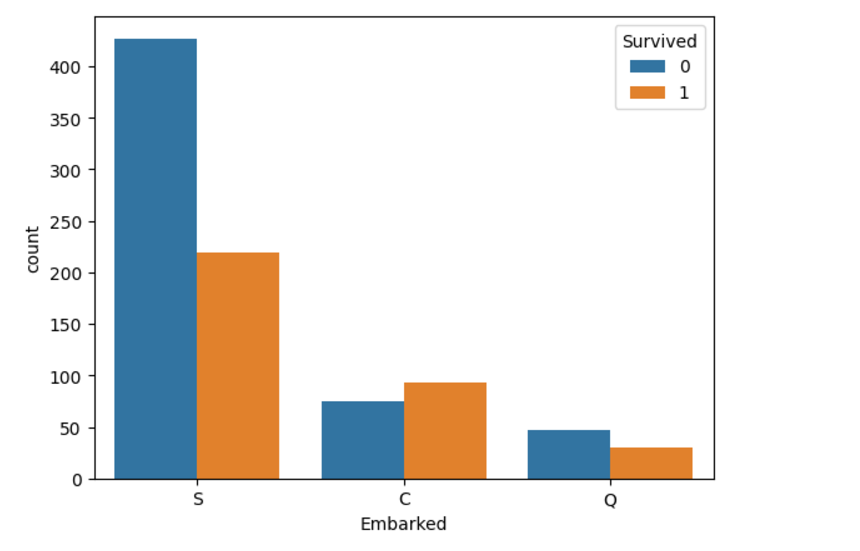
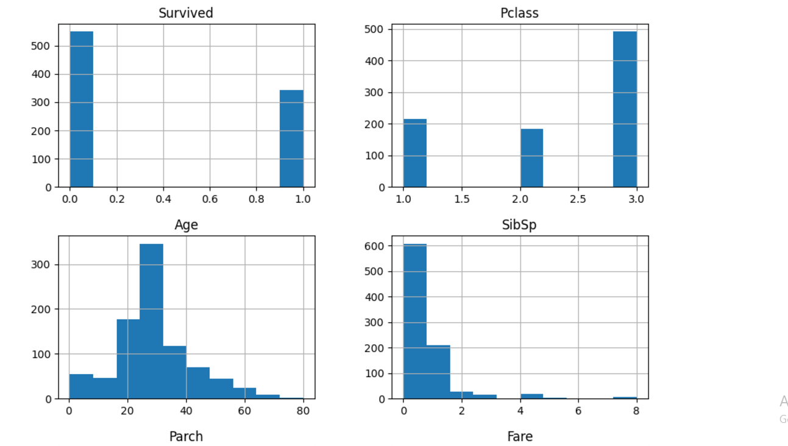
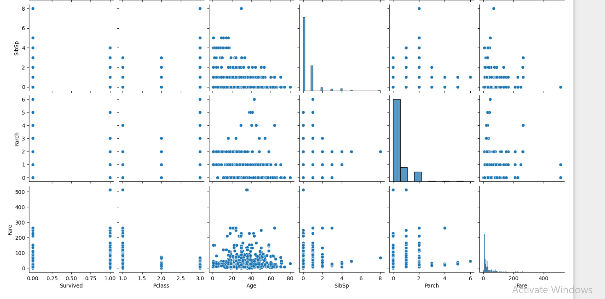

# Titanic Survival Data Analysis🚢💥
## Afame Technologies 

# Overview 🎯
This repository contains the code and resources for an internship project focused on analyzing the Titanic survival dataset. The Titanic, a British passenger liner, tragically sank on its maiden voyage in 1912 after hitting an iceberg. This dataset includes passenger information such as demographics, ticket details, and whether they survived or not. The goal of this analysis is to explore survival rates based on various passenger characteristics, including gender, age, ticket class, and family relationships. Insights from this analysis will offer actionable recommendations to improve safety in similar future scenarios.

# Dataset 📊
The dataset used in this analysis contains the following features:

- PassengerId: A unique identifier for each passenger. 🎫
- Survived: A binary variable representing whether the passenger survived (1 = Yes, 0 = No). ✅❌
- Pclass: Ticket class (1 = First, 2 = Second, 3 = Third). 🎟️
- Name: The full name of the passenger. ✍️
- Sex: The gender of the passenger (male or female). 👨👩
- Age: The age of the passenger in years. 👶👵
- SibSp: The number of siblings or spouses the passenger had aboard the Titanic. 👨‍👩‍👧‍👦
- Parch: The number of parents or children the passenger had aboard the Titanic. 👪
- Ticket: The ticket number issued for the passenger. 🎟️
- Fare: The amount of money paid for the ticket. 💵
- Cabin: The cabin number assigned to the passenger (if available). 🛏️
- Embarked: The port where the passenger embarked (C = Cherbourg, Q = Queenstown, S = Southampton). ⚓
# Analysis
## Summary Statistics 📈:

Review dataset distribution, missing values, and basic statistics for variables like age, fare, and survival status.
Example Output:

- Average age: 29.7 years 👶
Proportion of survivors: 38% 🏆
Missing age values: 177 ❓
Handling Missing Values ⚠️:

- Address missing Age by imputing with the median.
Drop rows with missing Cabin data due to its low percentage. 🚫
Encoding Categorical Variables 🔠:

- Convert Sex and Embarked to numeric values for analysis.
Sex: Male = 0, Female = 1
Embarked: Cherbourg = 0, Queenstown = 1, Southampton = 2
Exploring Survival Factors 🔍:

- Investigate how gender, age, ticket class, and family size affect survival.
Key Questions:

- Does gender influence survival rates? 👩‍🦳🧑‍🦱
Is survival more likely for first-class passengers? 🛳️💎
Visualizations 📊:

- Create visualizations to understand survival trends across key variables.
Survival Rates by Gender 👩‍🦱 vs 👨‍🦳:

- Observation: Women had a higher survival rate (74%) than men (19%) 🏆🚺
Survival Rates by Age Group 🧑‍🦳 vs 👶:

- Insight: Children under 10 had the highest survival rate (>80%), while seniors had lower survival chances 👶💔👴
Impact of Ticket Class 💺:

- Finding: First-class passengers had the highest survival rate (62%), while third-class had only 24% 🥇🛳️
Family Size Influence 👪:

- Observation: Passengers with fewer family members onboard had higher survival rates 🚶‍♀️🚶‍♂️
Fare and Survival 💵:

- Insight: Higher fare correlates with better survival chances, especially in first-class cabins 🛳️💸
Embarked Port and Survival ⚓:

- Observation: Passengers from Cherbourg (C) had the highest survival rates ⛴️🚢
Insights & Recommendations 🧠:

- Women and Children: Prioritize women and children for lifeboat access 🚺👶
Ticket Class: Ensure equal access to lifeboats across all classes 💺⚖️
Targeted Rescue Strategies:

- Focus on elderly passengers and those in lower ticket classes for better survival chances 👴👵
# Project Structure 📂
The project follows an organized folder structure for easy navigation:

- data/: Contains the Titanic dataset file (titanic.csv).
- notebook/: Jupyter Notebooks for detailed analysis and visualizations. 📑
- images/: Folder to store plots and visualizations 📸
- README.md: Project overview and setup instructions. 📖
- LICENSE: Licensing information for the project. ⚖️
# Getting Started 🚀
1.Clone the repository
Download the project files to your local system.
bash
Copy code
git clone https://github.com/your-repository/titanic-survival-analysis.git  
2.Navigate to the project directory
Open your terminal or command prompt and go to the project folder:
bash
Copy code
cd titanic-survival-analysis 

3.Install required dependencies
To install all the necessary libraries, run the following command:
bash
Copy code
pip install -r requirements.txt

4.Open and run Jupyter notebooks
Open the notebook/ folder and launch Jupyter Notebook:
bash
Copy code
jupyter notebook  

5. Explore the results
Explore the visualizations and insights generated from the dataset in the notebooks. Review the plots and analysis summaries to gather key findings.

# Visualizations 📊
This project provides various visualizations to help better understand the survival trends:

- Survival Rates by Gender 👩‍🦱 vs 👨‍🦳
- Survival Rates by Age Group 👶
### Survived According to Gender

### Percentage of Gender Ratio

### Embarked relation with Survived

### Hist plots of All the Columns

### Pairplots

